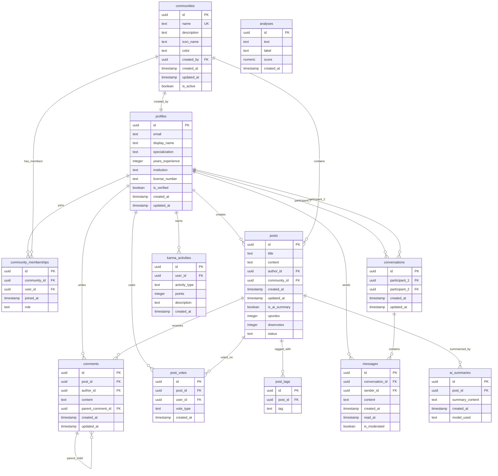

# Database Schema Reference

## Entity Relationship Diagram



## Table Specifications

### Core User Tables

#### profiles
**Purpose**: Store healthcare professional information and credentials
**Primary Key**: `id` (UUID, references auth.users)

| Column | Type | Constraints | Description |
|--------|------|-------------|-------------|
| id | UUID | PRIMARY KEY, REFERENCES auth.users(id) | User identifier |
| email | TEXT | NOT NULL | User email address |
| display_name | TEXT | NULLABLE | Public display name |
| specialization | TEXT | NULLABLE | Medical specialty |
| years_experience | INTEGER | NULLABLE | Years in practice |
| institution | TEXT | NULLABLE | Current workplace |
| license_number | TEXT | NULLABLE | Medical license number |
| is_verified | BOOLEAN | DEFAULT false | Verification status |
| created_at | TIMESTAMPTZ | DEFAULT now() | Account creation time |
| updated_at | TIMESTAMPTZ | DEFAULT now() | Last profile update |

**Indexes**:
- Primary key on `id`
- Unique constraint on `email`

**Triggers**:
- `update_profiles_updated_at`: Auto-update timestamp on changes
- `on_auth_user_created`: Auto-create profile on user registration

---

#### communities
**Purpose**: Medical specialty discussion groups
**Primary Key**: `id` (UUID)

| Column | Type | Constraints | Description |
|--------|------|-------------|-------------|
| id | UUID | PRIMARY KEY, DEFAULT gen_random_uuid() | Community identifier |
| name | TEXT | NOT NULL, UNIQUE | Community name |
| description | TEXT | NOT NULL | Community purpose |
| icon_name | TEXT | NOT NULL | Lucide icon identifier |
| color | TEXT | DEFAULT 'text-blue-500' | Tailwind color class |
| created_by | UUID | REFERENCES profiles(id) | Creator's profile ID |
| created_at | TIMESTAMPTZ | DEFAULT now() | Creation timestamp |
| updated_at | TIMESTAMPTZ | DEFAULT now() | Last update timestamp |
| is_active | BOOLEAN | DEFAULT true | Active status |

**Indexes**:
- Primary key on `id`
- Unique constraint on `name`
- Index on `created_by`

**Sample Data**:
```sql
INSERT INTO communities (name, description, icon_name, color) VALUES
('Cardiology', 'Heart conditions and cardiovascular medicine', 'Heart', 'text-red-500'),
('Neurology', 'Brain and nervous system disorders', 'Brain', 'text-purple-500'),
('Radiology', 'Medical imaging and diagnostics', 'Eye', 'text-blue-500'),
('Orthopedics', 'Musculoskeletal system', 'Bone', 'text-orange-500');
```

---

### Content Tables

#### posts
**Purpose**: Discussion posts within communities
**Primary Key**: `id` (UUID)

| Column | Type | Constraints | Description |
|--------|------|-------------|-------------|
| id | UUID | PRIMARY KEY, DEFAULT gen_random_uuid() | Post identifier |
| title | TEXT | NOT NULL | Post title |
| content | TEXT | NOT NULL | Post body content |
| author_id | UUID | NOT NULL, REFERENCES profiles(id) | Author's profile ID |
| community_id | UUID | NULLABLE, REFERENCES communities(id) | Associated community |
| created_at | TIMESTAMPTZ | DEFAULT now() | Creation timestamp |
| updated_at | TIMESTAMPTZ | DEFAULT now() | Last edit timestamp |
| is_ai_summary | BOOLEAN | DEFAULT false | AI-generated flag |
| upvotes | INTEGER | DEFAULT 0 | Upvote count |
| downvotes | INTEGER | DEFAULT 0 | Downvote count |
| status | TEXT | DEFAULT 'published' | Post status |

**Indexes**:
- `idx_posts_community_id` on `community_id`
- `idx_posts_author_id` on `author_id`
- `idx_posts_created_at` on `created_at DESC`

**Status Values**: 'draft', 'published', 'archived'

---

#### comments
**Purpose**: Threaded comments on posts
**Primary Key**: `id` (UUID)

| Column | Type | Constraints | Description |
|--------|------|-------------|-------------|
| id | UUID | PRIMARY KEY, DEFAULT gen_random_uuid() | Comment identifier |
| post_id | UUID | NOT NULL, REFERENCES posts(id) CASCADE | Parent post |
| author_id | UUID | NOT NULL, REFERENCES profiles(id) CASCADE | Comment author |
| content | TEXT | NOT NULL | Comment text |
| parent_comment_id | UUID | NULLABLE, REFERENCES comments(id) CASCADE | Parent comment for threading |
| created_at | TIMESTAMPTZ | DEFAULT now() | Creation timestamp |
| updated_at | TIMESTAMPTZ | DEFAULT now() | Last edit timestamp |

**Indexes**:
- `idx_comments_post_id` on `post_id`

**Features**:
- Supports unlimited nesting via `parent_comment_id`
- Cascade deletion when parent post is removed

---

### Engagement Tables

#### post_votes
**Purpose**: User voting system for posts
**Primary Key**: `id` (UUID)

| Column | Type | Constraints | Description |
|--------|------|-------------|-------------|
| id | UUID | PRIMARY KEY, DEFAULT gen_random_uuid() | Vote identifier |
| post_id | UUID | NOT NULL, REFERENCES posts(id) CASCADE | Target post |
| user_id | UUID | NOT NULL, REFERENCES profiles(id) CASCADE | Voting user |
| vote_type | TEXT | CHECK (vote_type IN ('upvote', 'downvote')) | Vote direction |
| created_at | TIMESTAMPTZ | DEFAULT now() | Vote timestamp |

**Constraints**:
- `UNIQUE(post_id, user_id)`: One vote per user per post

**Indexes**:
- `idx_post_votes_post_id` on `post_id`

**Triggers**:
- `update_post_vote_counts_trigger`: Auto-update post vote counts

---

#### post_tags
**Purpose**: Tagging system for posts
**Primary Key**: `id` (UUID)

| Column | Type | Constraints | Description |
|--------|------|-------------|-------------|
| id | UUID | PRIMARY KEY, DEFAULT gen_random_uuid() | Tag identifier |
| post_id | UUID | NOT NULL, REFERENCES posts(id) CASCADE | Tagged post |
| tag | TEXT | NOT NULL | Tag text |

**Constraints**:
- `UNIQUE(post_id, tag)`: No duplicate tags per post

---

#### community_memberships
**Purpose**: User membership in communities
**Primary Key**: `id` (UUID)

| Column | Type | Constraints | Description |
|--------|------|-------------|-------------|
| id | UUID | PRIMARY KEY, DEFAULT gen_random_uuid() | Membership identifier |
| community_id | UUID | NOT NULL, REFERENCES communities(id) CASCADE | Target community |
| user_id | UUID | NOT NULL, REFERENCES profiles(id) CASCADE | Member user |
| joined_at | TIMESTAMPTZ | DEFAULT now() | Join timestamp |
| role | TEXT | DEFAULT 'member' | Member role |

**Constraints**:
- `UNIQUE(community_id, user_id)`: One membership per user per community

**Indexes**:
- `idx_community_memberships_user_id` on `user_id`
- `idx_community_memberships_community_id` on `community_id`

**Role Values**: 'member', 'moderator', 'admin'

---

### Messaging Tables

#### conversations
**Purpose**: Private conversations between users
**Primary Key**: `id` (UUID)

| Column | Type | Constraints | Description |
|--------|------|-------------|-------------|
| id | UUID | PRIMARY KEY, DEFAULT gen_random_uuid() | Conversation identifier |
| participant_1 | UUID | NOT NULL, REFERENCES profiles(id) CASCADE | First participant |
| participant_2 | UUID | NOT NULL, REFERENCES profiles(id) CASCADE | Second participant |
| created_at | TIMESTAMPTZ | DEFAULT now() | Creation timestamp |
| updated_at | TIMESTAMPTZ | DEFAULT now() | Last message timestamp |

**Constraints**:
- `UNIQUE(participant_1, participant_2)`: One conversation per user pair
- `CHECK (participant_1 != participant_2)`: Users can't message themselves

---

#### messages
**Purpose**: Individual messages within conversations
**Primary Key**: `id` (UUID)

| Column | Type | Constraints | Description |
|--------|------|-------------|-------------|
| id | UUID | PRIMARY KEY, DEFAULT gen_random_uuid() | Message identifier |
| conversation_id | UUID | NOT NULL, REFERENCES conversations(id) CASCADE | Parent conversation |
| sender_id | UUID | NOT NULL, REFERENCES profiles(id) CASCADE | Message sender |
| content | TEXT | NOT NULL | Message text |
| created_at | TIMESTAMPTZ | DEFAULT now() | Send timestamp |
| read_at | TIMESTAMPTZ | NULLABLE | Read timestamp |
| is_moderated | BOOLEAN | DEFAULT false | Moderation flag |

**Indexes**:
- `idx_messages_conversation_id` on `conversation_id`
- `idx_messages_created_at` on `created_at`

---

### Gamification Tables

#### karma_activities
**Purpose**: Track user reputation points
**Primary Key**: `id` (UUID)

| Column | Type | Constraints | Description |
|--------|------|-------------|-------------|
| id | UUID | PRIMARY KEY, DEFAULT gen_random_uuid() | Activity identifier |
| user_id | UUID | NOT NULL, REFERENCES profiles(id) CASCADE | Target user |
| activity_type | TEXT | NOT NULL | Activity category |
| points | INTEGER | NOT NULL | Points awarded |
| description | TEXT | NULLABLE | Activity description |
| created_at | TIMESTAMPTZ | DEFAULT now() | Activity timestamp |

**Indexes**:
- `idx_karma_activities_user_id` on `user_id`

**Activity Types**:
- `GIVE_UPVOTE`: +1 point
- `RECEIVE_UPVOTE`: +5 points
- `CREATE_POST`: +2 points
- `CREATE_COMMENT`: +1 point
- `DAILY_LOGIN`: +1 point

---

### AI & Analytics Tables

#### ai_summaries
**Purpose**: Store AI-generated content summaries
**Primary Key**: `id` (UUID)

| Column | Type | Constraints | Description |
|--------|------|-------------|-------------|
| id | UUID | PRIMARY KEY, DEFAULT gen_random_uuid() | Summary identifier |
| post_id | UUID | NOT NULL, REFERENCES posts(id) CASCADE | Summarized post |
| summary_content | TEXT | NOT NULL | Generated summary |
| created_at | TIMESTAMPTZ | DEFAULT now() | Generation timestamp |
| model_used | TEXT | NULLABLE | AI model identifier |

---

#### analyses
**Purpose**: Content analysis results (sentiment, toxicity, etc.)
**Primary Key**: `id` (UUID)

| Column | Type | Constraints | Description |
|--------|------|-------------|-------------|
| id | UUID | PRIMARY KEY, DEFAULT gen_random_uuid() | Analysis identifier |
| text | TEXT | NOT NULL | Analyzed text |
| label | TEXT | NOT NULL | Analysis result label |
| score | NUMERIC | NOT NULL | Confidence score |
| created_at | TIMESTAMPTZ | DEFAULT now() | Analysis timestamp |

## Database Functions & Triggers

### Automatic Timestamp Updates
```sql
CREATE OR REPLACE FUNCTION update_updated_at_column()
RETURNS TRIGGER AS $$
BEGIN
  NEW.updated_at = now();
  RETURN NEW;
END;
$$ LANGUAGE plpgsql;
```

### Vote Count Management
```sql
CREATE OR REPLACE FUNCTION update_post_vote_counts()
RETURNS TRIGGER AS $$
BEGIN
  -- Updates post upvotes/downvotes when votes change
  UPDATE posts SET 
    upvotes = (SELECT COUNT(*) FROM post_votes WHERE post_id = NEW.post_id AND vote_type = 'upvote'),
    downvotes = (SELECT COUNT(*) FROM post_votes WHERE post_id = NEW.post_id AND vote_type = 'downvote')
  WHERE id = NEW.post_id;
  RETURN NEW;
END;
$$ LANGUAGE plpgsql;
```

### User Profile Creation
```sql
CREATE OR REPLACE FUNCTION handle_new_user()
RETURNS TRIGGER AS $$
BEGIN
  INSERT INTO profiles (id, email, display_name)
  VALUES (
    NEW.id,
    NEW.email,
    COALESCE(NEW.raw_user_meta_data->>'display_name', split_part(NEW.email, '@', 1))
  );
  RETURN NEW;
END;
$$ LANGUAGE plpgsql;
```

## Row Level Security Policies

### Profile Policies
```sql
-- Public read access
CREATE POLICY "Profiles are viewable by everyone" 
ON profiles FOR SELECT USING (true);

-- Users can only modify their own profile
CREATE POLICY "Users can update their own profile" 
ON profiles FOR UPDATE USING (auth.uid() = id);
```

### Community Policies
```sql
-- Public read access to active communities
CREATE POLICY "Anyone can view active communities" 
ON communities FOR SELECT USING (is_active = true);

-- Authenticated users can create communities
CREATE POLICY "Authenticated users can create communities" 
ON communities FOR INSERT TO authenticated
WITH CHECK (auth.uid() = created_by);
```

### Post Policies
```sql
-- Public read access to published posts
CREATE POLICY "Anyone can view published posts" 
ON posts FOR SELECT USING (status = 'published');

-- Authors can modify their own posts
CREATE POLICY "Authors can update their own posts" 
ON posts FOR UPDATE TO authenticated
USING (auth.uid() = author_id);
```

### Messaging Policies
```sql
-- Users can only access their own conversations
CREATE POLICY "Users can view their own conversations" 
ON conversations FOR SELECT TO authenticated
USING (auth.uid() IN (participant_1, participant_2));

-- Users can only send messages in their conversations
CREATE POLICY "Users can send messages" 
ON messages FOR INSERT TO authenticated
WITH CHECK (
  auth.uid() = sender_id AND
  EXISTS (
    SELECT 1 FROM conversations 
    WHERE id = conversation_id 
    AND auth.uid() IN (participant_1, participant_2)
  )
);
```

## Performance Considerations

### Query Optimization
- All foreign keys have corresponding indexes
- Composite indexes on frequently queried combinations
- Partial indexes on filtered queries (e.g., active communities)

### Caching Strategy
- React Query for client-side caching
- Supabase real-time subscriptions for live updates
- Database-level caching via connection pooling

### Scaling Considerations
- Horizontal scaling via read replicas
- Partitioning large tables (messages, karma_activities)
- CDN for static assets and images