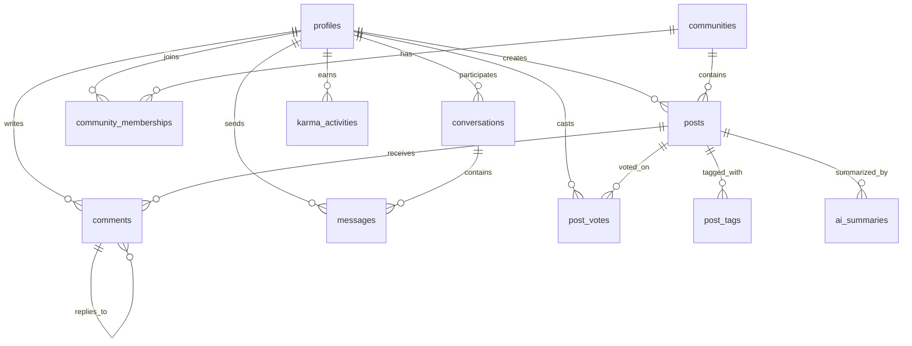

# Med-Thread-AI Documentation

## Project Overview

**Med-Thread-AI** (also known as "Doc Hangout") is a dynamic medical collaboration platform designed for healthcare professionals to connect, share knowledge, and collaborate in specialized communities. The platform combines social networking features with AI-powered tools to enhance medical discussions and knowledge sharing.

### Key Features
- **Specialty Communities**: Organized hangout rooms for different medical specialties
- **Professional Verification**: Medical license and credential verification system
- **AI-Powered Summaries**: Automated content summarization for posts
- **Karma System**: Reputation-based point system for user engagement
- **Real-time Messaging**: Direct communication between healthcare professionals
- **Content Moderation**: Safety features for professional discussions
- **PWA Support**: Progressive Web App capabilities for mobile access

## Technology Stack

### Frontend
- **React 18** - UI framework
- **TypeScript** - Type safety
- **Vite** - Build tool and development server
- **Tailwind CSS** - Styling framework
- **shadcn/ui** - Component library
- **React Router** - Client-side routing
- **React Query** - Data fetching and caching

### Backend & Database
- **Supabase** - Backend-as-a-Service
- **PostgreSQL** - Primary database
- **Row Level Security (RLS)** - Data access control
- **Real-time subscriptions** - Live updates

### Key Dependencies
```json
{
  "@supabase/supabase-js": "^2.57.0",
  "@tanstack/react-query": "^5.83.0",
  "react": "^18.3.1",
  "react-router-dom": "^6.30.1",
  "tailwindcss": "^3.4.17",
  "lucide-react": "^0.462.0"
}
```

## Project Structure

```
med-thread-ai/
├── public/                     # Static assets
│   ├── manifest.json          # PWA manifest
│   ├── sw.js                  # Service worker
│   └── icons/                 # App icons
├── src/
│   ├── components/            # Reusable UI components
│   │   ├── ui/               # shadcn/ui components
│   │   ├── Header.tsx        # Navigation header
│   │   ├── HeroSection.tsx   # Landing page hero
│   │   ├── AuthSection.tsx   # Authentication UI
│   │   └── ...
│   ├── hooks/                # Custom React hooks
│   │   ├── useAuth.tsx       # Authentication logic
│   │   ├── usePosts.tsx      # Post management
│   │   ├── useCommunities.tsx # Community operations
│   │   ├── useMessages.tsx   # Messaging system
│   │   ├── useKarma.tsx      # Karma system
│   │   └── ...
│   ├── pages/                # Route components
│   │   ├── Index.tsx         # Home page
│   │   ├── Auth.tsx          # Login/Register
│   │   ├── Communities.tsx   # Community browser
│   │   ├── Messages.tsx      # Messaging interface
│   │   └── ...
│   ├── integrations/         # External service integrations
│   │   └── supabase/
│   │       ├── client.ts     # Supabase client setup
│   │       └── types.ts      # Database type definitions
│   ├── services/             # Business logic services
│   │   └── verificationService.ts # Medical verification
│   └── lib/                  # Utility functions
├── supabase/                 # Database migrations and config
│   ├── migrations/           # SQL migration files
│   └── config.toml          # Supabase configuration
└── docs/                    # Documentation files
```

## Database Schema

### Core Tables

#### 1. profiles
User profile information for healthcare professionals.

```sql
CREATE TABLE public.profiles (
  id UUID PRIMARY KEY REFERENCES auth.users(id),
  email TEXT NOT NULL,
  display_name TEXT,
  specialization TEXT,
  years_experience INTEGER,
  institution TEXT,
  license_number TEXT,
  is_verified BOOLEAN DEFAULT false,
  created_at TIMESTAMP WITH TIME ZONE DEFAULT now(),
  updated_at TIMESTAMP WITH TIME ZONE DEFAULT now()
);
```

**Fields:**
- `id`: User UUID (links to Supabase auth.users)
- `email`: User's email address
- `display_name`: Public display name
- `specialization`: Medical specialty (e.g., "Cardiology", "Neurology")
- `years_experience`: Years of medical practice
- `institution`: Current workplace/hospital
- `license_number`: Medical license number
- `is_verified`: Professional verification status

#### 2. communities
Medical specialty communities/hangout rooms.

```sql
CREATE TABLE public.communities (
  id UUID PRIMARY KEY DEFAULT gen_random_uuid(),
  name TEXT NOT NULL UNIQUE,
  description TEXT NOT NULL,
  icon_name TEXT NOT NULL,
  color TEXT DEFAULT 'text-blue-500',
  created_by UUID REFERENCES profiles(id),
  created_at TIMESTAMP WITH TIME ZONE DEFAULT now(),
  updated_at TIMESTAMP WITH TIME ZONE DEFAULT now(),
  is_active BOOLEAN DEFAULT true
);
```

**Fields:**
- `name`: Community name (e.g., "Cardiology", "Emergency Medicine")
- `description`: Community purpose and guidelines
- `icon_name`: Lucide icon identifier
- `color`: Tailwind CSS color class
- `created_by`: Community creator's profile ID
- `is_active`: Whether community accepts new posts/members

#### 3. posts
Discussion posts within communities.

```sql
CREATE TABLE public.posts (
  id UUID PRIMARY KEY DEFAULT gen_random_uuid(),
  title TEXT NOT NULL,
  content TEXT NOT NULL,
  author_id UUID NOT NULL REFERENCES profiles(id),
  community_id UUID REFERENCES communities(id),
  created_at TIMESTAMP WITH TIME ZONE DEFAULT now(),
  updated_at TIMESTAMP WITH TIME ZONE DEFAULT now(),
  is_ai_summary BOOLEAN DEFAULT false,
  upvotes INTEGER DEFAULT 0,
  downvotes INTEGER DEFAULT 0,
  status TEXT DEFAULT 'published'
);
```

**Fields:**
- `title`: Post title/subject
- `content`: Post body content
- `author_id`: Post creator's profile ID
- `community_id`: Associated community (nullable for general posts)
- `is_ai_summary`: Whether post is AI-generated summary
- `upvotes`/`downvotes`: Vote counts (updated via triggers)
- `status`: 'draft', 'published', or 'archived'

#### 4. comments
Threaded comments on posts.

```sql
CREATE TABLE public.comments (
  id UUID PRIMARY KEY DEFAULT gen_random_uuid(),
  post_id UUID NOT NULL REFERENCES posts(id),
  author_id UUID NOT NULL REFERENCES profiles(id),
  content TEXT NOT NULL,
  parent_comment_id UUID REFERENCES comments(id),
  created_at TIMESTAMP WITH TIME ZONE DEFAULT now(),
  updated_at TIMESTAMP WITH TIME ZONE DEFAULT now()
);
```

**Features:**
- Supports nested/threaded comments via `parent_comment_id`
- Cascade deletion when parent post is deleted

### Engagement & Social Features

#### 5. post_votes
User voting on posts (upvote/downvote system).

```sql
CREATE TABLE public.post_votes (
  id UUID PRIMARY KEY DEFAULT gen_random_uuid(),
  post_id UUID NOT NULL REFERENCES posts(id),
  user_id UUID NOT NULL REFERENCES profiles(id),
  vote_type TEXT CHECK (vote_type IN ('upvote', 'downvote')),
  created_at TIMESTAMP WITH TIME ZONE DEFAULT now(),
  UNIQUE(post_id, user_id)
);
```

**Features:**
- One vote per user per post (enforced by unique constraint)
- Automatic vote count updates via database triggers

#### 6. post_tags
Tagging system for posts.

```sql
CREATE TABLE public.post_tags (
  id UUID PRIMARY KEY DEFAULT gen_random_uuid(),
  post_id UUID NOT NULL REFERENCES posts(id),
  tag TEXT NOT NULL,
  UNIQUE(post_id, tag)
);
```

#### 7. community_memberships
User membership in communities.

```sql
CREATE TABLE public.community_memberships (
  id UUID PRIMARY KEY DEFAULT gen_random_uuid(),
  community_id UUID NOT NULL REFERENCES communities(id),
  user_id UUID NOT NULL REFERENCES profiles(id),
  joined_at TIMESTAMP WITH TIME ZONE DEFAULT now(),
  role TEXT DEFAULT 'member',
  UNIQUE(community_id, user_id)
);
```

**Roles:**
- `member`: Regular community participant
- `moderator`: Can moderate content
- `admin`: Full community management rights

### Messaging System

#### 8. conversations
Private conversations between users.

```sql
CREATE TABLE public.conversations (
  id UUID PRIMARY KEY DEFAULT gen_random_uuid(),
  participant_1 UUID NOT NULL REFERENCES profiles(id),
  participant_2 UUID NOT NULL REFERENCES profiles(id),
  created_at TIMESTAMP WITH TIME ZONE DEFAULT now(),
  updated_at TIMESTAMP WITH TIME ZONE DEFAULT now(),
  UNIQUE(participant_1, participant_2),
  CHECK (participant_1 != participant_2)
);
```

#### 9. messages
Individual messages within conversations.

```sql
CREATE TABLE public.messages (
  id UUID PRIMARY KEY DEFAULT gen_random_uuid(),
  conversation_id UUID NOT NULL REFERENCES conversations(id),
  sender_id UUID NOT NULL REFERENCES profiles(id),
  content TEXT NOT NULL,
  created_at TIMESTAMP WITH TIME ZONE DEFAULT now(),
  read_at TIMESTAMP WITH TIME ZONE,
  is_moderated BOOLEAN DEFAULT false
);
```

### Gamification & AI Features

#### 10. karma_activities
Karma/reputation point tracking.

```sql
CREATE TABLE public.karma_activities (
  id UUID PRIMARY KEY DEFAULT gen_random_uuid(),
  user_id UUID NOT NULL REFERENCES profiles(id),
  activity_type TEXT NOT NULL,
  points INTEGER NOT NULL,
  description TEXT,
  created_at TIMESTAMP WITH TIME ZONE DEFAULT now()
);
```

**Activity Types:**
- `GIVE_UPVOTE`: +1 point for upvoting content
- `RECEIVE_UPVOTE`: +5 points for receiving upvotes
- `CREATE_POST`: +2 points for creating posts
- `CREATE_COMMENT`: +1 point for commenting
- `DAILY_LOGIN`: +1 point for daily activity

#### 11. ai_summaries
AI-generated content summaries.

```sql
CREATE TABLE public.ai_summaries (
  id UUID PRIMARY KEY DEFAULT gen_random_uuid(),
  post_id UUID NOT NULL REFERENCES posts(id),
  summary_content TEXT NOT NULL,
  created_at TIMESTAMP WITH TIME ZONE DEFAULT now(),
  model_used TEXT
);
```

#### 12. analyses
Content analysis results (sentiment, toxicity, etc.).

```sql
CREATE TABLE public.analyses (
  id UUID PRIMARY KEY DEFAULT gen_random_uuid(),
  text TEXT NOT NULL,
  label TEXT NOT NULL,
  score NUMERIC NOT NULL,
  created_at TIMESTAMP WITH TIME ZONE DEFAULT now()
);
```

## Database Relationships & Linkages

### Primary Relationships



### Key Foreign Key Constraints

1. **User-Generated Content**
   - `posts.author_id` → `profiles.id`
   - `comments.author_id` → `profiles.id`
   - `messages.sender_id` → `profiles.id`

2. **Community Structure**
   - `posts.community_id` → `communities.id`
   - `community_memberships.community_id` → `communities.id`
   - `community_memberships.user_id` → `profiles.id`

3. **Engagement Features**
   - `post_votes.post_id` → `posts.id`
   - `post_votes.user_id` → `profiles.id`
   - `post_tags.post_id` → `posts.id`

4. **Messaging System**
   - `conversations.participant_1` → `profiles.id`
   - `conversations.participant_2` → `profiles.id`
   - `messages.conversation_id` → `conversations.id`

5. **AI & Analytics**
   - `ai_summaries.post_id` → `posts.id`
   - `karma_activities.user_id` → `profiles.id`

## Security & Access Control

### Row Level Security (RLS) Policies

All tables have RLS enabled with specific policies:

#### Profile Access
```sql
-- Anyone can view profiles
CREATE POLICY "Profiles are viewable by everyone" 
ON profiles FOR SELECT USING (true);

-- Users can only update their own profile
CREATE POLICY "Users can update their own profile" 
ON profiles FOR UPDATE USING (auth.uid() = id);
```

#### Community Access
```sql
-- Anyone can view active communities
CREATE POLICY "Anyone can view active communities" 
ON communities FOR SELECT USING (is_active = true);

-- Authenticated users can create communities
CREATE POLICY "Authenticated users can create communities" 
ON communities FOR INSERT TO authenticated
WITH CHECK (auth.uid() = created_by);
```

#### Post Access
```sql
-- Anyone can view published posts
CREATE POLICY "Anyone can view published posts" 
ON posts FOR SELECT USING (status = 'published');

-- Authors can update their own posts
CREATE POLICY "Authors can update their own posts" 
ON posts FOR UPDATE TO authenticated
USING (auth.uid() = author_id);
```

#### Messaging Privacy
```sql
-- Users can only view their own conversations
CREATE POLICY "Users can view their own conversations" 
ON conversations FOR SELECT TO authenticated
USING (auth.uid() IN (participant_1, participant_2));
```

## API Architecture

### Custom Hooks for Data Management

#### Authentication (`useAuth.tsx`)
```typescript
interface AuthContextType {
  user: User | null;
  session: Session | null;
  signUp: (email: string, password: string, displayName?: string) => Promise<{ error: any }>;
  signIn: (email: string, password: string) => Promise<{ error: any }>;
  signOut: () => Promise<void>;
  loading: boolean;
}
```

#### Posts Management (`usePosts.tsx`)
```typescript
interface Post {
  id: string;
  title: string;
  content: string;
  author: PostAuthor;
  community?: Community;
  post_tags: PostTag[];
  upvotes: number;
  downvotes: number;
  user_vote?: { vote_type: string };
}

// Key functions:
- fetchPosts(communityId?: string)
- createPost(postData)
- voteOnPost(postId, voteType)
```

#### Communities (`useCommunities.tsx`)
```typescript
interface Community {
  id: string;
  name: string;
  description: string;
  member_count: number;
  post_count: number;
  is_member: boolean;
}

// Key functions:
- joinCommunity(communityId)
- leaveCommunity(communityId)
- createCommunity(communityData)
```

#### Messaging (`useMessages.tsx`)
```typescript
interface Conversation {
  id: string;
  other_participant: Profile;
  last_message?: Message;
  unread_count: number;
}

// Key functions:
- createOrGetConversation(otherUserId)
- sendMessage(conversationId, content)
- selectConversation(conversationId)
```

## Verification System

### Medical License Verification (`verificationService.ts`)

The platform includes a comprehensive verification system for healthcare professionals:

#### Verification Methods
1. **NPI Verification**: Validates National Provider Identifier against CMS registry
2. **State License Verification**: Checks medical licenses with state medical boards
3. **Document Verification**: OCR-based document analysis
4. **Institution Verification**: Validates workplace credentials

#### Verification Process
```typescript
interface VerificationResult {
  isValid: boolean;
  confidence: number;
  details: {
    licenseValid?: boolean;
    npiValid?: boolean;
    documentValid?: boolean;
    institutionValid?: boolean;
  };
  errors?: string[];
}
```

#### Supported State APIs
- California Medical Board
- New York State Health Department
- Texas Medical Board
- (Extensible for additional states)

## Deployment & Configuration

### Environment Variables
```env
VITE_SUPABASE_URL=your_supabase_url
VITE_SUPABASE_ANON_KEY=your_supabase_anon_key
```

### Build Commands
```bash
# Development
npm run dev

# Production build
npm run build

# Preview production build
npm run preview
```

### PWA Configuration
The app includes Progressive Web App features:
- Service worker for offline functionality
- Web app manifest for installation
- Responsive design for mobile devices

## Performance Optimizations

### Database Indexes
```sql
-- Post performance
CREATE INDEX idx_posts_community_id ON posts(community_id);
CREATE INDEX idx_posts_created_at ON posts(created_at DESC);

-- Comment performance
CREATE INDEX idx_comments_post_id ON comments(post_id);

-- Messaging performance
CREATE INDEX idx_messages_conversation_id ON messages(conversation_id);

-- User activity
CREATE INDEX idx_karma_activities_user_id ON karma_activities(user_id);
```

### Query Optimization
- React Query for caching and background updates
- Supabase real-time subscriptions for live data
- Optimistic updates for better UX

## Future Enhancements

### Planned Features
1. **Advanced AI Integration**
   - Medical literature search
   - Diagnostic assistance
   - Treatment recommendations

2. **Enhanced Verification**
   - Blockchain-based credentials
   - Multi-factor verification
   - Continuing education tracking

3. **Collaboration Tools**
   - Video conferencing integration
   - File sharing capabilities
   - Case study collaboration

4. **Analytics Dashboard**
   - Community engagement metrics
   - User activity analytics
   - Content performance insights

## Contributing

### Development Setup
1. Clone the repository
2. Install dependencies: `npm install`
3. Set up Supabase project and configure environment variables
4. Run migrations: `supabase db push`
5. Start development server: `npm run dev`

### Code Standards
- TypeScript for type safety
- ESLint for code quality
- Tailwind CSS for consistent styling
- Component-based architecture

This documentation provides a comprehensive overview of the Med-Thread-AI platform architecture, database design, and implementation details. The system is designed to be scalable, secure, and maintainable while providing healthcare professionals with powerful collaboration tools.